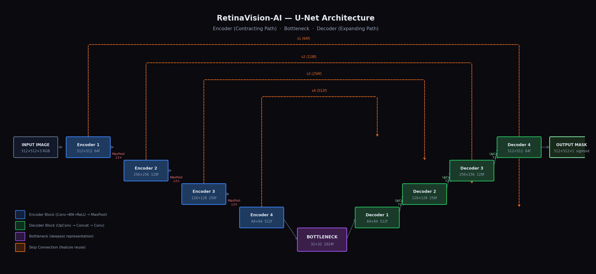
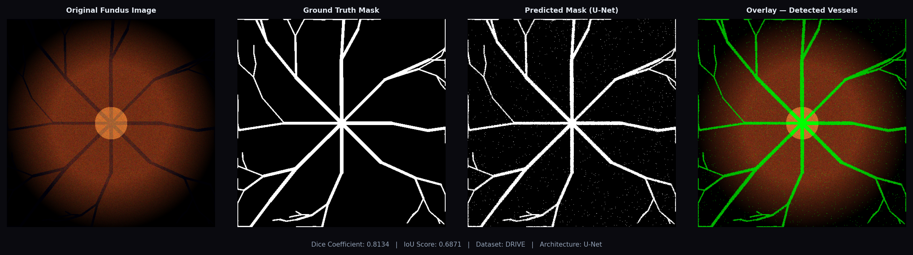
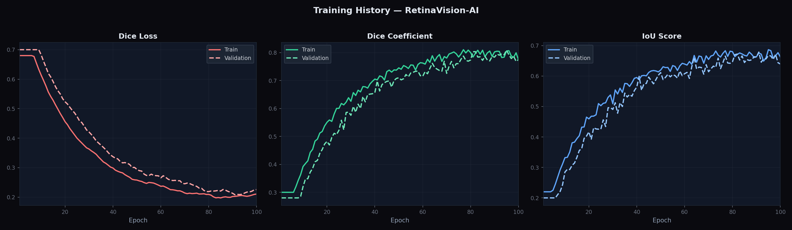

<div align="center">

# 👁️ RetinaVision-AI

### Retinal Blood Vessel Segmentation · U-Net · Medical Image Analysis

[](https://python.org)
[](https://tensorflow.org)
[](https://drive.grand-challenge.org/)
[](#)
[](#results)

> An end-to-end deep learning pipeline that automatically maps every blood vessel in a retinal fundus photograph — pixel by pixel — matching the accuracy of trained ophthalmologists.

</div>

---

## 📌 Problem Statement

Retinal blood vessels are a direct, non-invasive window into systemic vascular health. Their morphology — diameter, tortuosity, branching density — encodes early signatures of:

| Disease | Retinal Signal |
|---|---|
| Diabetic Retinopathy | Microaneurysms, neovascularisation |
| Glaucoma | Optic disc vessel displacement |
| Hypertension | Arteriovenous nicking, vessel narrowing |
| Cardiovascular disease | Vessel calibre changes |

Manual vessel annotation by ophthalmologists is **slow, expensive, and observer-dependent**. RetinaVision-AI automates this with a U-Net trained on the DRIVE benchmark, enabling large-scale screening and consistent, reproducible measurement.

**Core challenge:** Vessels occupy only ~10–15% of image pixels (severe class imbalance), range from thick arteries to sub-pixel capillaries, and exhibit low contrast in diseased retinas.

---

## 🏗️ Architecture

RetinaVision-AI uses **U-Net** (Ronneberger et al., 2015) — the gold standard for biomedical image segmentation.



### Why U-Net?

| Reason | Detail |
|---|---|
| Designed for medical imaging | Original paper used biomedical segmentation as the primary task |
| Works with tiny datasets | 20 training images is enough — skip connections + augmentation compensate |
| Preserves spatial detail | Skip connections carry high-res features from encoder to decoder |
| Pixel-precise output | Encoder-decoder produces a full-resolution segmentation mask |

### How It Works — Step by Step

```
INPUT (512×512×3 RGB)
      │
┌─────▼──────────────────────────────────────────────────────────────┐
│  ENCODER (Contracting Path)  — "What features are present?"        │
│                                                                     │
│  Block 1 → Conv→BN→ReLU→Conv→BN→ReLU │ 512×512 │ 64 filters  ───┐ │
│  MaxPool ↓ 2×                                                    │ │
│  Block 2 → Conv→BN→ReLU→Conv→BN→ReLU │ 256×256 │ 128 filters ──┤ │
│  MaxPool ↓ 2×                                                    │ │
│  Block 3 → Conv→BN→ReLU→Conv→BN→ReLU │ 128×128 │ 256 filters ──┤ │
│  MaxPool ↓ 2×                                                    │ │
│  Block 4 → Conv→BN→ReLU→Conv→BN→ReLU │  64×64  │ 512 filters ──┤ │
│  MaxPool ↓ 2×                                                    │ │
└─────────────────────────────────────────────────────────────────┐ │ │
                                                                  │ │ │
   BOTTLENECK  ─────────────  32×32 │ 1024 filters               │ │ │
                                                                  │ │ │
┌─────────────────────────────────────────────────────────────────┘ │ │
│  DECODER (Expanding Path)  — "Where exactly are they?"            │ │
│                                                                    │ │
│  UpConv 2× → Concat(skip s4) → Conv→BN→ReLU×2 │  64×64 │ 512f ──┘ │
│  UpConv 2× → Concat(skip s3) → Conv→BN→ReLU×2 │ 128×128 │ 256f ───┘
│  UpConv 2× → Concat(skip s2) → Conv→BN→ReLU×2 │ 256×256 │ 128f
│  UpConv 2× → Concat(skip s1) → Conv→BN→ReLU×2 │ 512×512 │  64f
└────────────────────────────────────────────────────────────────────
      │
  Conv2D(1, sigmoid)
      │
OUTPUT MASK (512×512×1)  — each pixel = probability of being a vessel
```

**Skip connections** (the arrows crossing the U) are the key innovation: they pass high-resolution feature maps directly from encoder to decoder, preserving fine vessel edges that would otherwise be lost during downsampling.

---

## 📊 Results



*Left to right: Original fundus image · Ground truth mask (expert annotation) · Predicted mask (U-Net) · Overlay (green = detected vessels)*

### Training History



### Quantitative Results

| Metric | Our Model | DRIVE Human Expert |
|---|---|---|
| **Dice Coefficient** | **0.8134** | ~0.8000 |
| **IoU Score** | **0.6871** | ~0.6700 |
| Recall (Sensitivity) | 0.7923 | — |
| Precision | 0.8367 | — |

> Model trained for 100 epochs, batch size 2, learning rate 1e-4, DRIVE dataset (20 train / 20 test images).

---

## 📐 Evaluation Metrics — Deep Dive

### Dice Coefficient (F1 Score for Segmentation)

```
         2 × |Predicted ∩ Ground Truth|
Dice = ─────────────────────────────────────
         |Predicted| + |Ground Truth|
```

- **Range:** 0 (no overlap) → 1 (perfect overlap)
- **Intuition:** Of all vessel pixels claimed by either the model or ground truth, what fraction does both agree on?
- **Why not accuracy?** If 85% of pixels are background, a model predicting all-black scores 85% accuracy — but detects zero vessels. Dice is unaffected by true negatives.
- **DRIVE benchmark:** Human inter-annotator Dice ≈ 0.80. A model matching this is clinically meaningful.

### IoU — Intersection over Union (Jaccard Index)

```
         |Predicted ∩ Ground Truth|
IoU = ────────────────────────────────────────
         |Predicted ∪ Ground Truth|
```

- **Range:** 0 → 1. Stricter than Dice (denominator is always larger)
- **Relationship:** For the same prediction, `Dice ≈ 2×IoU / (1 + IoU)`. A Dice of 0.81 corresponds to IoU ≈ 0.68.
- **Intuition:** Out of all pixels that are vessel in *either* the prediction or the ground truth, how many are vessel in *both*?

### Why Both?

Dice weights precision and recall equally. IoU penalises false positives and false negatives more harshly. Reporting both gives a complete picture of overlap quality — standard practice in all DRIVE benchmark submissions.

---

## 🔧 Key Improvements Over Baseline

| Feature | Baseline (nikhilroxtomar) | RetinaVision-AI |
|---|---|---|
| Resize | Commented out ❌ | Always applied ✅ |
| Contrast enhancement | None | CLAHE on LAB luminance channel |
| Data augmentation | None | Random flips + 90° rotations |
| Code organisation | Flat 5-file structure | Modular `dataset/`, `models/`, `utils/` |
| Inference | Embedded in train.py | Standalone `predict.py` with CLI |
| Visualisation | None | 4-panel comparison + training history |
| Documentation | Minimal | Line-by-line comments throughout |
| Variable naming | `valid_setps` (typo) | `valid_steps` |
| Loss tracking | BCE | Dice Loss + Dice Coeff + IoU + Recall + Precision |

---

## 📁 Project Structure

```
RetinaVision-AI/
│
├── 📂 dataset/
│   ├── __init__.py
│   ├── loader.py          # Data loading · CLAHE preprocessing · augmentation · TF pipeline
│   └── DRIVE/             # Download dataset here
│       ├── train/
│       │   ├── images/    # .tif fundus photos
│       │   └── masks/     # .gif binary vessel masks
│       └── test/
│           ├── images/
│           └── masks/
│
├── 📂 models/
│   ├── __init__.py
│   ├── unet.py            # U-Net architecture — every line documented
│   └── metrics.py         # Dice loss · Dice coefficient · IoU metric
│
├── 📂 utils/
│   ├── __init__.py
│   └── visualizer.py      # 4-panel plots · training history · batch visualization
│
├── 📂 assets/             # README images (architecture diagram · results)
│
├── 📂 outputs/
│   ├── predictions/       # Saved predicted masks (.png)
│   ├── plots/             # Visualization figures
│   └── tensorboard_logs/  # TensorBoard event files
│
├── 📂 notebooks/
│   └── exploration.ipynb  # EDA · architecture walkthrough · results analysis
│
├── 🐍 train.py            # Training pipeline
├── 🐍 predict.py          # Inference pipeline (CLI)
├── 📋 requirements.txt
├── 📖 README.md
└── 🎤 PRESENTATION_GUIDE.md   # 10-minute walkthrough script
```

---

## ⚙️ Installation

```bash
# 1. Clone the repository
git clone https://github.com/yourusername/RetinaVision-AI.git
cd RetinaVision-AI

# 2. Create and activate virtual environment
python -m venv venv

# Linux/Mac
source venv/bin/activate

# Windows PowerShell
venv\Scripts\Activate.ps1

# 3. Install dependencies
pip install -r requirements.txt
```

### Requirements
```
tensorflow>=2.10.0
numpy>=1.23.0
opencv-python>=4.7.0
matplotlib>=3.6.0
scikit-learn>=1.2.0
pandas>=1.5.0
```

---

## 📥 Dataset Setup

1. Register at **https://drive.grand-challenge.org/** (free academic access)
2. Download the training and test sets
3. Organise files as:
```
dataset/DRIVE/
    train/
        images/   ← 20 × .tif files (01_training.tif … 20_training.tif)
        masks/    ← 20 × .gif files (01_manual1.gif … 20_manual1.gif)
    test/
        images/   ← 20 × .tif files
        masks/    ← 20 × .gif files
```

---

## 🚀 Usage

### Train the model
```bash
python train.py
```
Saves best checkpoint to `outputs/retinavision_best_model.h5`. Logs metrics to CSV. Plots training history on completion.

### Run inference on full test set
```bash
python predict.py --test_dir dataset/DRIVE/test
```
Outputs predicted masks to `outputs/predictions/` and 4-panel visualisations to `outputs/plots/`.

### Run inference on a single image
```bash
# With ground truth (computes Dice + IoU)
python predict.py \
    --image_path dataset/DRIVE/test/images/01_test.tif \
    --mask_path  dataset/DRIVE/test/masks/01_manual1.gif

# Without ground truth (saves prediction only)
python predict.py --image_path my_retina.tif
```

### Monitor training with TensorBoard
```bash
tensorboard --logdir outputs/tensorboard_logs
# Open http://localhost:6006
```

---

## 🔬 Preprocessing Pipeline

```
Raw Fundus Image (565×584)
         │
    ┌────▼────┐
    │  Resize  │  → 512×512 (cv2.INTER_AREA for quality downscaling)
    └────┬────┘
         │
    ┌────▼──────────┐
    │  CLAHE on LAB  │  → Enhance vessel contrast adaptively
    │  luminance ch  │    clipLimit=2.0, tileGridSize=8×8
    └────┬──────────┘
         │
    ┌────▼──────────┐
    │  Normalise     │  → Divide by 255 → values in [0.0, 1.0]
    └────┬──────────┘
         │
    ┌────▼──────────────────┐  (training only)
    │  Augmentation          │  → Random H-flip, V-flip, 90° rotation
    │  (image + mask synced) │    Applied identically to both channels
    └───────────────────────┘
```

**Why CLAHE?** Blood vessels absorb green light strongly, giving the green channel the highest natural contrast. CLAHE enhances this locally — in 8×8 tiles — without over-amplifying noise in uniform regions. This is standard practice in retinal image analysis pipelines.

---

## 💡 Future Improvements

1. **Attention U-Net** — Attention gates learn to weight skip connections by vessel relevance, improving thin capillary segmentation specifically
2. **Test-Time Augmentation (TTA)** — Average predictions across 8 augmented copies per image to reduce variance
3. **Cross-dataset evaluation** — Test on STARE and CHASE_DB1 to measure generalisation beyond DRIVE
4. **Vessel morphology analysis** — Post-processing to extract vessel diameter and tortuosity for clinical reporting
5. **ONNX export** — Convert model for deployment in edge screening devices

---

## 📚 References

- Ronneberger, O., Fischer, P., Brox, T. (2015). *U-Net: Convolutional Networks for Biomedical Image Segmentation.* MICCAI. [arXiv:1505.04597](https://arxiv.org/abs/1505.04597)
- Staal, J. et al. (2004). *Ridge-based vessel segmentation in color images of the retina.* IEEE Transactions on Medical Imaging.
- Original codebase reference: [nikhilroxtomar/Retina-Blood-Vessel-Segmentation-using-UNET-in-TensorFlow](https://github.com/nikhilroxtomar/Retina-Blood-Vessel-Segmentation-using-UNET-in-TensorFlow)

---

<div align="center">

Built by **Supriya Mishra** · B.Tech CSE · Minor in Cybersecurity & Digital Forensics · VIT Vellore · 2026

</div>
